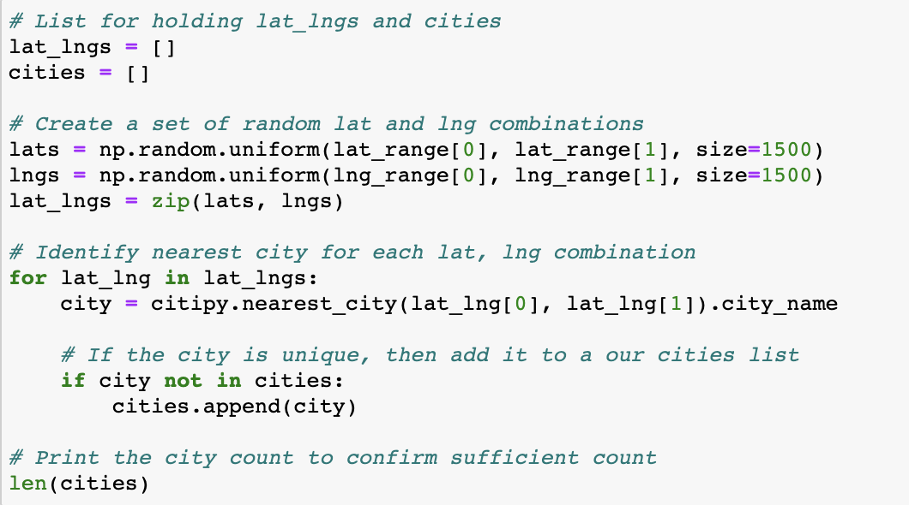
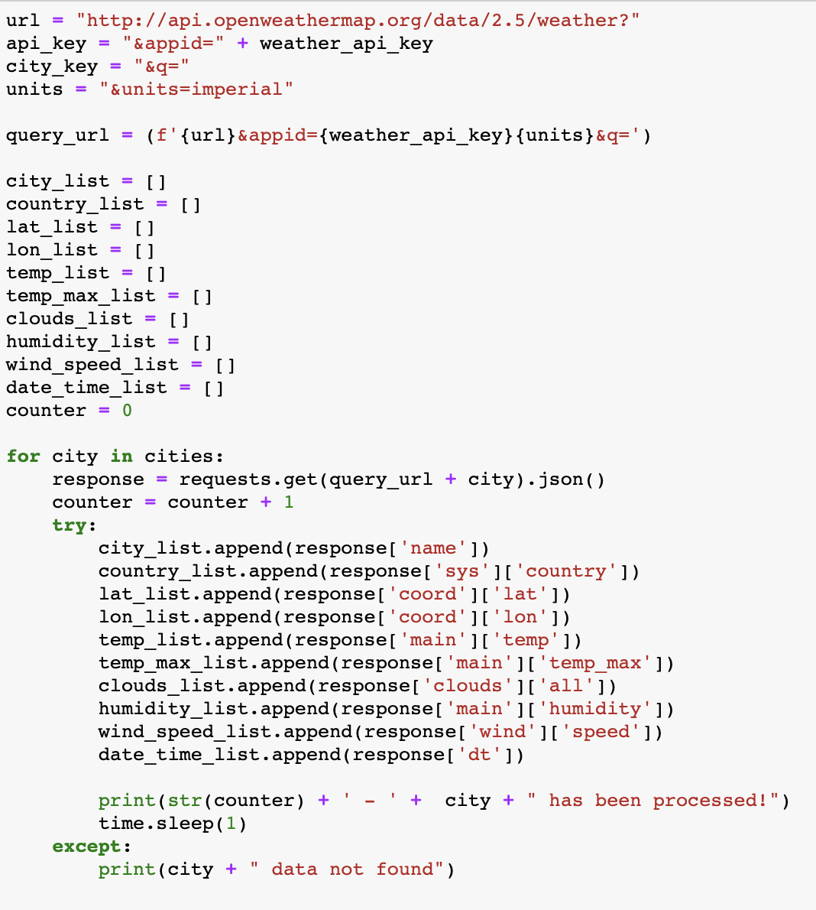
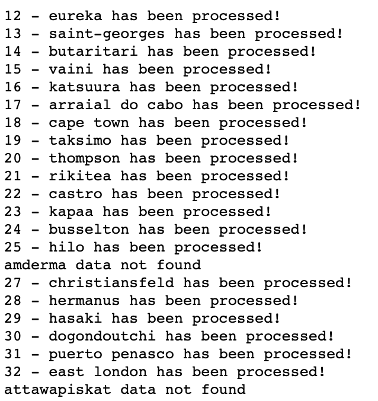
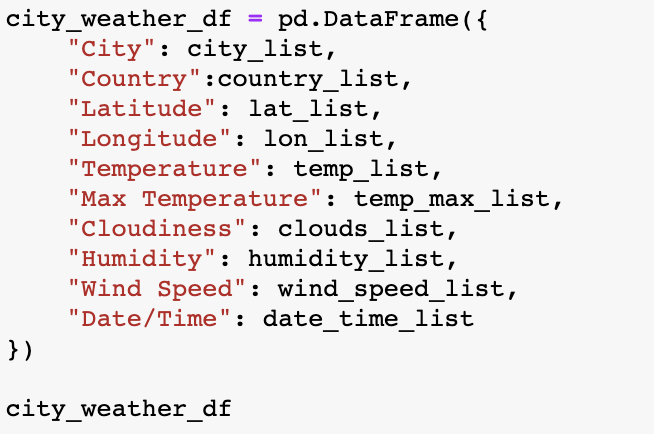
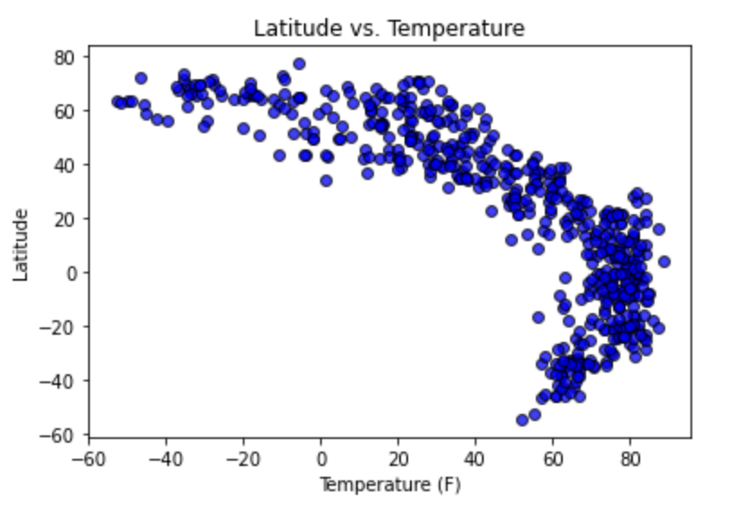
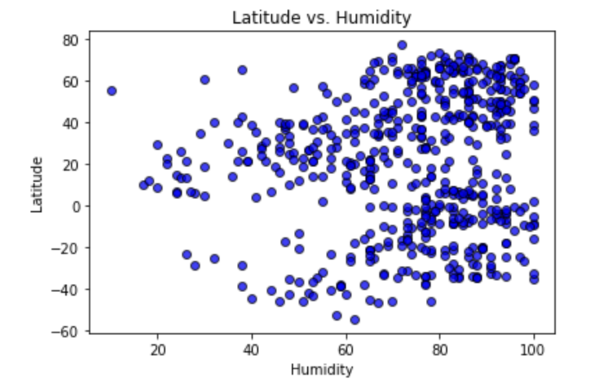
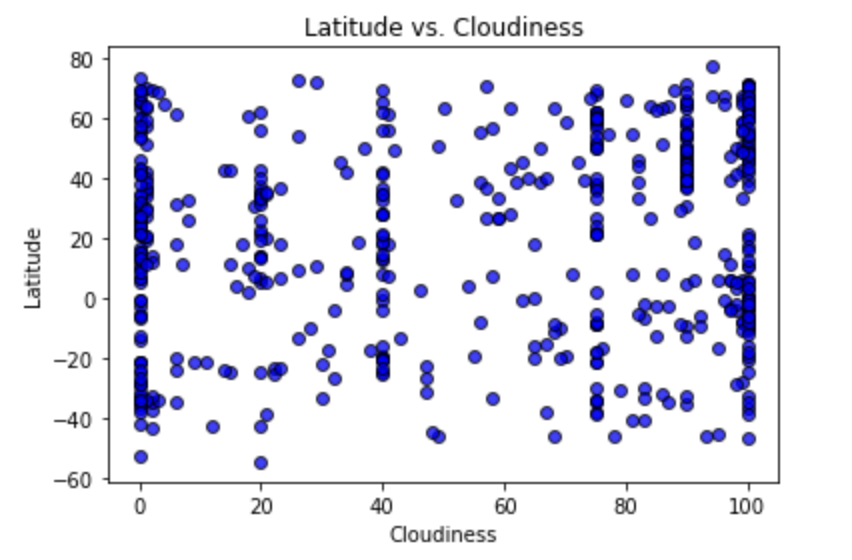
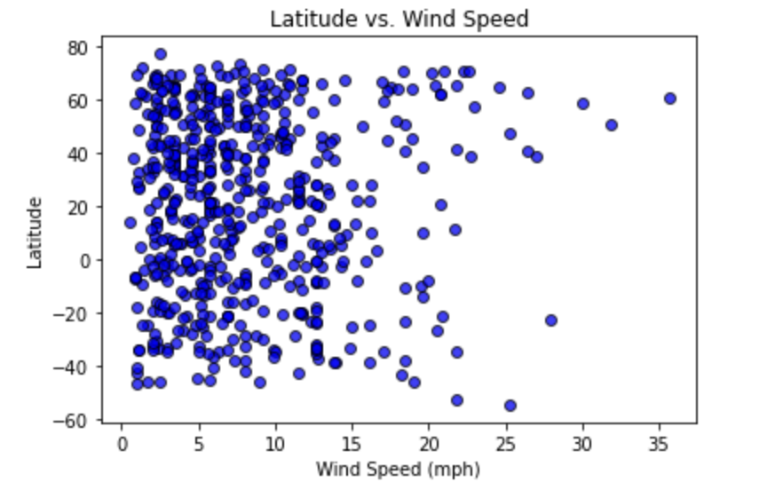

# python-api-challenge

<h1>Part I - WeatherPy</h1>

To better understand weather patterns in various cities across the world, a representative model was created using Python libraries and the OpenWeatherMap API to visualize the weather of 500+ cities across the world of varying distance from the equator. 

To create a list of cities, NumPy was used to create a set of random latitude and longitude combinations.  Once the lat/lng coordinates were produced, citipy was used to identify the nearest city to each coordinate.

  

Next, a weather check on each city was conducting using a series of successive API calls.  Included was a print log of each city as it was being processed (with the city number and city name).

  
   

Data was then converted into a data frame.

  

To visual what the data was telling us, a series of scatter plots to showcase the following relationships:

  
   

  
   

