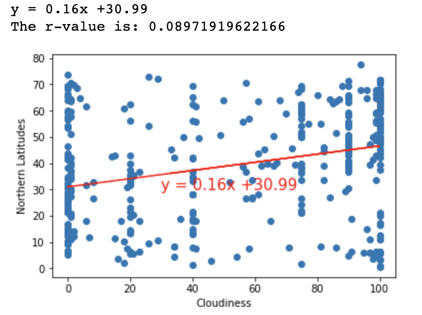
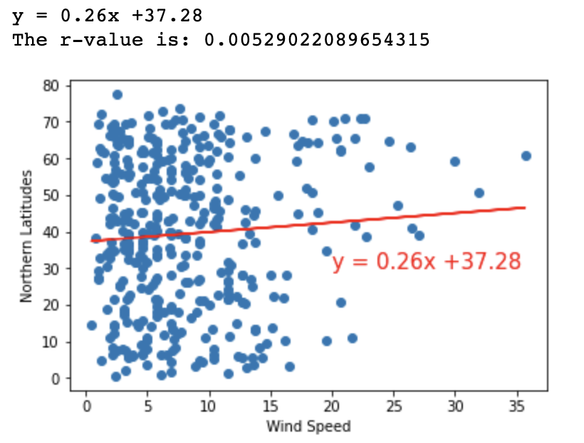
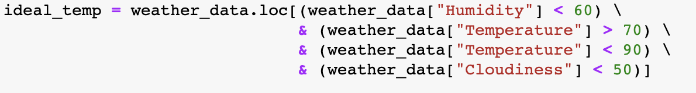
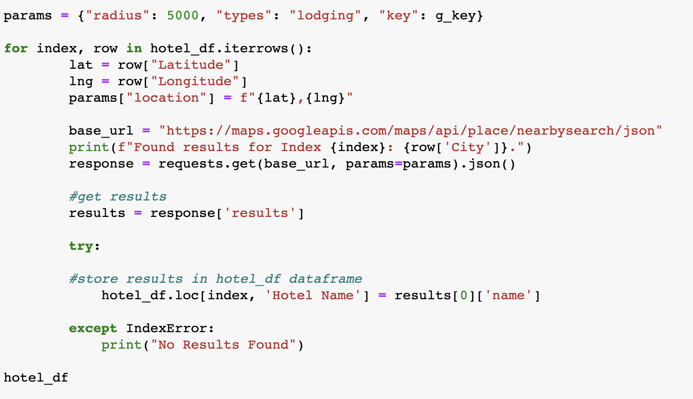
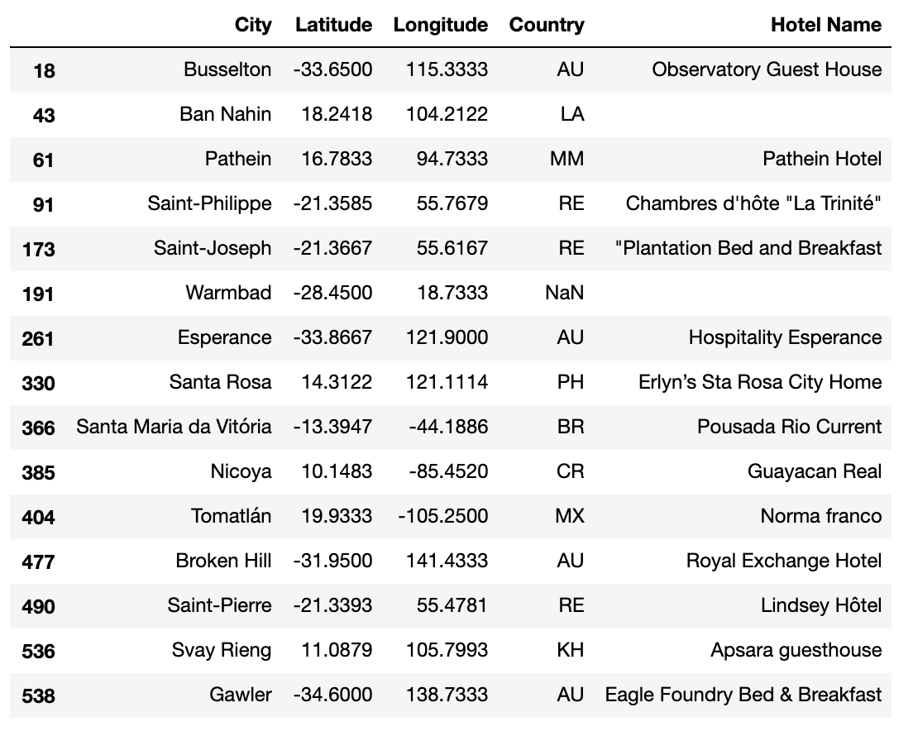
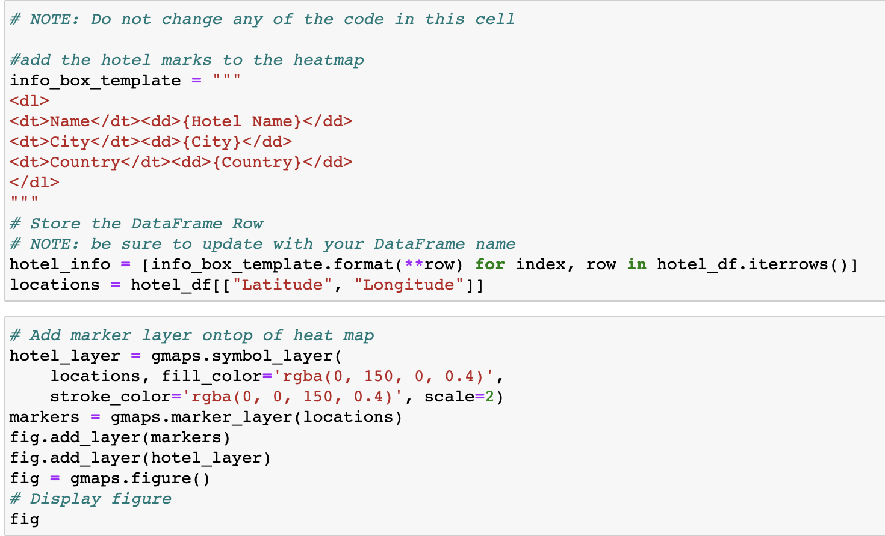

# python-api-challenge

To better understand weather patterns in various cities across the world, a representative model was created using Python libraries and the OpenWeatherMap API to visualize the weather of 500+ cities across the world of varying distance from the equator. 

<h1>Part I - WeatherPy</h1>

To create a list of cities, NumPy was used to create a set of random latitude and longitude combinations.  Once the lat/lng coordinates were produced, citipy was used to identify the nearest city to each coordinate.

  

Next, a weather check on each city was conducting using a series of successive API calls.  Included was a print log of each city as it was being processed (with the city number and city name).

  
   

Data was then converted into a data frame.

  

To visual what the data was telling us, a series of scatter plots to showcase the following relationships:

  
   

  
   

Additionally, linear regressions were run on each relationship to determine how much correlation existed between the variables.  Below are a couple examples:

  
   

<h1>Part II - VacationPy</h1>

Once weather conditions for the cities across the world were found they were used to determine what the best city to vacation would be.  In this section, jupyter-gmaps and the Google Places API were used.

The first step was to narrow down the data frame to those locations that matched my ideal weather conditions and drop any rows that didn't match.

  

Next, using the Google Places API, the first hotel for each city located within 5000 meters of my coordinates was identified.

  
   

Finally, the hotels were plotted on a humidity heatmap.

  
   

